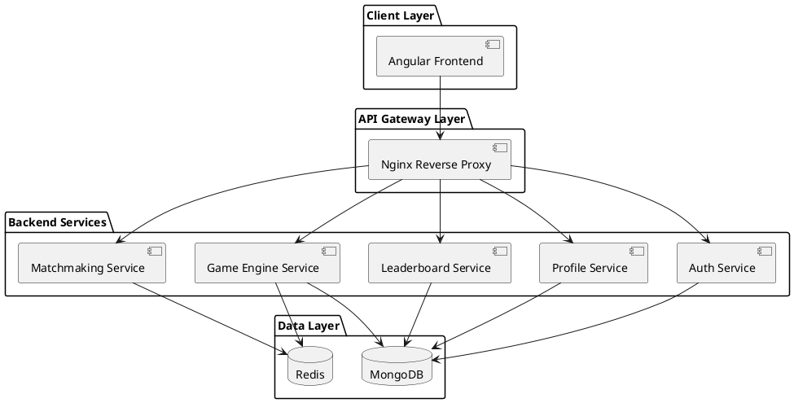
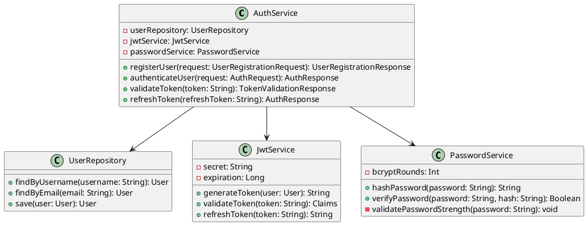
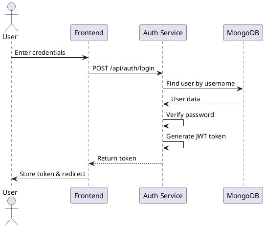
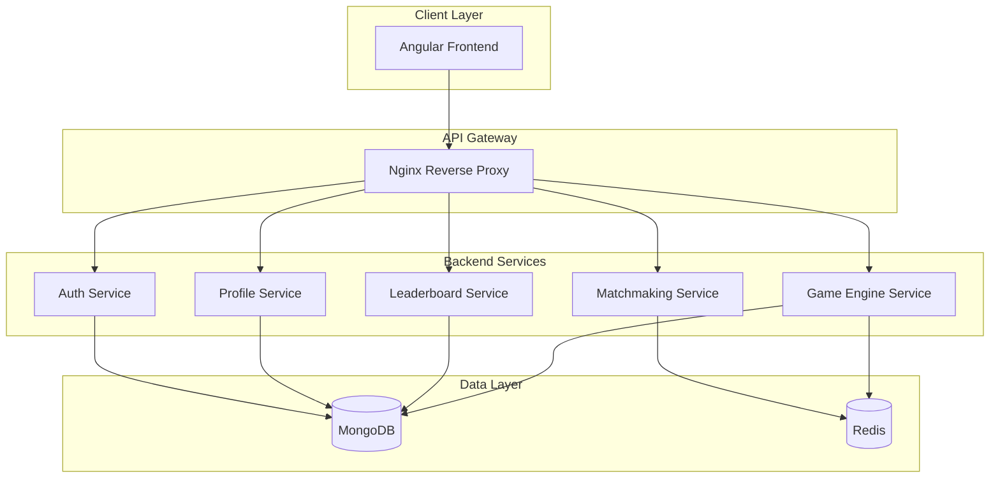
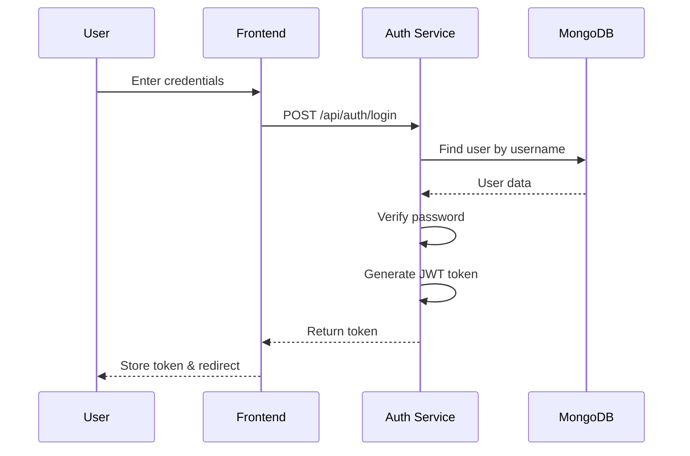

# 🎨 UML Diagram Setup Guide
## Battle Arena - Documentation Diagrams

**Last Updated:** 2024

---

## ⚠️ CRITICAL DESIGN PRINCIPLES

**All diagrams and documentation MUST strictly adhere to the following principles:**

1. **REUSABILITY** - All components, services, and utilities MUST be designed for maximum reusability
2. **GOOD CODE PRACTICES** - Follow SOLID principles, DRY, and industry best practices
3. **CLEAN CODE** - Code must be readable, self-documenting, and maintainable
4. **CLEAN ARCHITECTURE** - Strict separation of concerns with clear boundaries
5. **SECURE PROGRAMMING** - Security-first approach with defense in depth

---

## 📊 Recommended UML Diagram Tools for Cursor IDE

### 🏆 Top 3 Recommendations

#### 1. **PlantUML Extension** ⭐ RECOMMENDED
**Best for:** Text-based UML diagrams, version control, Git-friendly

**Features:**
- ✅ Text-based UML syntax (easy to version control)
- ✅ Real-time preview in IDE
- ✅ Export to PNG, SVG, PDF
- ✅ Supports all UML diagram types
- ✅ Renders in markdown files
- ✅ Works with Git (diagrams as text files)

**Installation:**
```bash
# 1. Install PlantUML extension in Cursor/VS Code
# Search for "PlantUML" by jebbs in Extensions

# 2. Install Graphviz (required for PlantUML)
# macOS:
brew install graphviz

# Windows:
# Download from https://graphviz.org/download/

# Linux (Ubuntu/Debian):
sudo apt install graphviz

# Linux (Fedora):
sudo dnf install graphviz
```

**Usage:**
1. Create a `.puml` file (e.g., `architecture.puml`)
2. Write PlantUML syntax
3. Press `Alt+D` to preview
4. Export to PNG: `Ctrl+Shift+P` → "PlantUML: Export Current Diagram"

**Extension ID:** `jebbs.plantuml`

---

#### 2. **Mermaid Extension** ⭐ ALSO RECOMMENDED
**Best for:** Modern diagrams, markdown rendering, web-friendly

**Features:**
- ✅ Text-based diagram syntax
- ✅ Renders directly in markdown files
- ✅ Export to PNG, SVG
- ✅ Modern, clean syntax
- ✅ GitHub/GitLab native support
- ✅ Works with Git

**Installation:**
```bash
# Install Mermaid extension in Cursor/VS Code
# Search for "Markdown Preview Mermaid Support" by bierner
# OR "Mermaid Preview" by vstirbu
```

**Usage:**
1. Create a `.md` file
2. Use mermaid code blocks:
   ````markdown
   ```mermaid
   graph TD
   A[Client] --> B[API Gateway]
   ```
   ````
3. Preview in markdown
4. Export to PNG: Use Mermaid CLI or online tool

**Extension IDs:**
- `bierner.markdown-mermaid`
- `vstirbu.vscode-mermaid-preview`

---

#### 3. **Draw.io Integration** ⭐ GOOD FOR VISUAL EDITING
**Best for:** Visual diagram editing, complex diagrams, non-technical users

**Features:**
- ✅ Visual drag-and-drop editor
- ✅ Export to PNG, SVG, PDF
- ✅ Works in VS Code
- ✅ Can save as XML (version control friendly)
- ✅ Extensive shape library

**Installation:**
```bash
# Install Draw.io extension in Cursor/VS Code
# Search for "Draw.io Integration" by Henning Dieterichs
```

**Usage:**
1. Create a `.drawio` file
2. Open in Draw.io editor (in VS Code)
3. Design diagram visually
4. Export to PNG: File → Export As → PNG

**Extension ID:** `hediet.vscode-drawio`

---

## 🚀 Quick Start Guide

### Option 1: PlantUML (Recommended for UML)

#### Step 1: Install PlantUML Extension
1. Open Cursor IDE
2. Press `Cmd+Shift+X` (Mac) or `Ctrl+Shift+X` (Windows/Linux)
3. Search for "PlantUML"
4. Install "PlantUML" by jebbs

#### Step 2: Install Graphviz
```bash
# macOS
brew install graphviz

# Verify installation
dot -V
```

#### Step 3: Configure PlantUML
1. Open Cursor Settings (`Cmd+,` or `Ctrl+,`)
2. Search for "PlantUML"
3. Set PlantUML server (optional):
   ```
   "plantuml.server": "https://www.plantuml.com/plantuml"
   ```

#### Step 4: Create Your First Diagram
1. Create a new file: `docs/diagrams/architecture.puml`
2. Add PlantUML code (see examples below)
3. Press `Alt+D` to preview
4. Export to PNG: `Cmd+Shift+P` → "PlantUML: Export Current Diagram"

---

### Option 2: Mermaid (Recommended for Markdown)

#### Step 1: Install Mermaid Extension
1. Open Cursor IDE
2. Press `Cmd+Shift+X` (Mac) or `Ctrl+Shift+X` (Windows/Linux)
3. Search for "Mermaid Preview"
4. Install "Mermaid Preview" by vstirbu

#### Step 2: Use in Markdown
1. Create/edit a markdown file
2. Use mermaid code blocks:
   ````markdown
   ```mermaid
   graph TD
   A[Client] --> B[API Gateway]
   ```
   ````
3. Preview in markdown preview

#### Step 3: Export to PNG
```bash
# Install Mermaid CLI
npm install -g @mermaid-js/mermaid-cli

# Export to PNG
mmdc -i diagram.mmd -o diagram.png
```

---

## 📝 Diagram Examples

### PlantUML Examples

#### System Architecture Diagram


#### Class Diagram Example


#### Sequence Diagram Example


---

### Mermaid Examples

#### System Architecture (Mermaid)


#### Sequence Diagram (Mermaid)


---

## 📁 Recommended File Structure

```
battle-arena/
├── docs/
│   ├── diagrams/
│   │   ├── architecture.puml          # System architecture
│   │   ├── class-diagrams/
│   │   │   ├── auth-service.puml
│   │   │   ├── profile-service.puml
│   │   │   └── game-engine.puml
│   │   ├── sequence-diagrams/
│   │   │   ├── authentication.puml
│   │   │   ├── matchmaking.puml
│   │   │   └── gameplay.puml
│   │   ├── exported/
│   │   │   ├── architecture.png
│   │   │   └── ...
│   │   └── README.md                  # Diagram documentation
│   ├── 01-HIGH_LEVEL_DESIGN.md
│   ├── 02-LOW_LEVEL_DESIGN.md
│   └── ...
```

---

## 🔧 Exporting Diagrams to PNG

### PlantUML Export

#### Method 1: Using VS Code Command
1. Open `.puml` file
2. Press `Cmd+Shift+P` (Mac) or `Ctrl+Shift+P` (Windows/Linux)
3. Type "PlantUML: Export Current Diagram"
4. Select PNG format
5. Choose save location

#### Method 2: Using Command Line
```bash
# Install PlantUML CLI
# macOS
brew install plantuml

# Export to PNG
plantuml -tpng diagrams/architecture.puml -o ../exported

# Export all diagrams
plantuml -tpng diagrams/**/*.puml -o exported
```

#### Method 3: Using PlantUML Server
```bash
# Export using online server
curl "http://www.plantuml.com/plantuml/png/~1" -o diagram.png
```

---

### Mermaid Export

#### Method 1: Using Mermaid CLI
```bash
# Install Mermaid CLI
npm install -g @mermaid-js/mermaid-cli

# Export to PNG
mmdc -i diagram.mmd -o diagram.png

# Export with theme
mmdc -i diagram.mmd -o diagram.png -t dark

# Export all diagrams
mmdc -i diagrams/**/*.mmd -o exported/
```

#### Method 2: Using Online Tool
1. Go to https://mermaid.live/
2. Paste mermaid code
3. Export as PNG

---

### Draw.io Export

1. Open `.drawio` file in VS Code
2. Click "File" in Draw.io editor
3. Select "Export As" → "PNG"
4. Choose resolution and save location

---

## 🎯 Best Practices

### 1. Version Control
- ✅ Store `.puml` or `.mmd` files in Git (text-based)
- ✅ Export PNG files for documentation
- ✅ Commit both source and exported files
- ✅ Use `.gitignore` for temporary files

### 2. Diagram Organization
- ✅ Organize diagrams by type (architecture, class, sequence)
- ✅ Use consistent naming conventions
- ✅ Document diagrams in README
- ✅ Keep diagrams updated with code

### 3. Diagram Quality
- ✅ Use consistent colors and styles
- ✅ Keep diagrams simple and readable
- ✅ Add legends for complex diagrams
- ✅ Use meaningful names and labels

### 4. Documentation Integration
- ✅ Reference diagrams in documentation
- ✅ Keep diagrams in sync with code
- ✅ Update diagrams when architecture changes
- ✅ Export diagrams for presentations

---

## 📚 Additional Resources

### PlantUML
- **Documentation:** https://plantuml.com/
- **Examples:** https://real-world-plantuml.com/
- **Syntax Guide:** https://plantuml.com/guide

### Mermaid
- **Documentation:** https://mermaid.js.org/
- **Live Editor:** https://mermaid.live/
- **Examples:** https://mermaid.js.org/intro/examples.html

### Draw.io
- **Documentation:** https://www.diagrams.net/doc/
- **Templates:** https://www.diagrams.net/templates
- **Shapes:** https://www.diagrams.net/shapes

---

## 🚨 Troubleshooting

### PlantUML Issues

#### Issue: Diagrams not rendering
**Solution:**
1. Check if Graphviz is installed: `dot -V`
2. Check PlantUML extension settings
3. Restart VS Code/Cursor
4. Check Java is installed (required for PlantUML)

#### Issue: Export not working
**Solution:**
1. Check PlantUML server URL in settings
2. Try using local PlantUML installation
3. Check file permissions
4. Verify Graphviz is installed

### Mermaid Issues

#### Issue: Diagrams not rendering in markdown
**Solution:**
1. Check if Mermaid extension is installed
2. Check markdown preview settings
3. Verify mermaid code block syntax
4. Try reloading VS Code/Cursor

#### Issue: Export fails
**Solution:**
1. Check Mermaid CLI installation
2. Verify input file format
3. Check Node.js version
4. Try using online tool

---

## ✅ Checklist

### Setup Checklist
- [ ] Install PlantUML extension
- [ ] Install Graphviz
- [ ] Install Mermaid extension (optional)
- [ ] Install Draw.io extension (optional)
- [ ] Create diagrams directory
- [ ] Create first diagram
- [ ] Test export to PNG
- [ ] Commit diagrams to Git

### Diagram Creation Checklist
- [ ] Create system architecture diagram
- [ ] Create class diagrams for each service
- [ ] Create sequence diagrams for key flows
- [ ] Create database schema diagrams
- [ ] Export all diagrams to PNG
- [ ] Update documentation with diagram references
- [ ] Commit diagrams to Git

---

## 🎉 You're Ready!

You now have everything set up to create, view, and export UML diagrams in Cursor IDE. Choose the tool that works best for you:

- **PlantUML:** Best for UML diagrams, text-based, Git-friendly
- **Mermaid:** Best for modern diagrams, markdown rendering
- **Draw.io:** Best for visual editing, complex diagrams

**Remember:** Reusability | Good Code Practices | Clean Code | Clean Architecture | Secure Programming

---

**Document Control:**
- **Author:** Documentation Team
- **Last Updated:** 2024
- **Status:** Ready for Use

